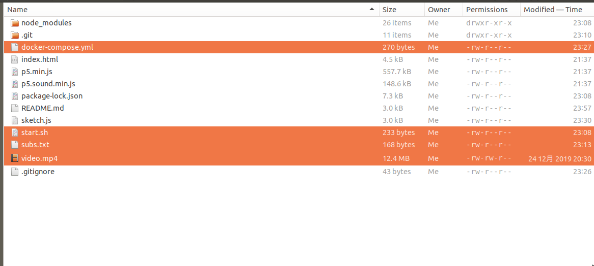

# fast-srt-subtitle
Make SRT Caption Fast!!!! This is a fast and dirty javascript SRT caption tool.

* Copy all the files to a folder.
* Put video.mp4 in the same folder.
* Put transcription (newline separated) to subs.txt in the same folder.
* Open a node.js http-server in that folder. (Don't use Python's web server, which has video-seeking problem)
* Goto your local http-server in Firefox/Chrome/Safari. 
* Controls:
  * K: Timestamp this line's end time & next line's start time 
  * L: Timestamp this line's end time
  * I: Scroll back one line 
  * O: Scroll forward one line
  * U: Rewind 5 seconds
  * P: Forward 5 seconds
  * Q: Make SRT File

Enjoy.

## execute the program by docker
 - install [docker engine and docker-compose](https://www.docker.com/products/docker-desktop) on your machine, on Windows and MacOS X, they are together in the Docker-desktop.
   - on Linux desktop, you need to install docker by your package-management i.e. apt-get, yum....etc and you must **install docker-compose manually**.
   - [how to install docker engine on linux desktop](https://docs.docker.com/install/)
   - [how to install docker-compose on linux desktop](https://docs.docker.com/compose/install/)

 - get the whole repo or just the `docker-compose.yml` and `start.sh`.
 - like the origin usage, Put `video.mp4`, `subs.txt` in the same folder.
 
 - open terminal go to the directory where docker-compose.yml and start.sh and other files in.
 - just execute `docker-compose up`.
 - open browser, visit `http://localhost:1234`.
 - use it.
 - when you want to shutdown the server and the container, hit `ctrl+c` on the terminal.
 - in this way, you don't need to install `node.js` on your computer, but you need to install `docker-engine` and `docker-compose` and every time you want to open the website, just execute `docker-compose up` under that directory.

 ## 透過docker來執行
 - 在電腦上安裝[docker engine and docker-compose](https://www.docker.com/products/docker-desktop)，在Windows and MacOS X上 它們被一起包在Docker-desktop上
   - 在Linux裝面環境上, 您必須自動手動透過套件管理程式（如：apt-get, yum...）手動安裝 docker-engine跟docker-compose，在Linux環境上，它們兩個是分開的
   - [如何在 Linux環境上安裝docker engine](https://docs.docker.com/install/)
   - [如何在 Linux環境上安裝docker-compose ](https://docs.docker.com/compose/install/)

 - 下載這整個repo 或只要`docker-compose.yml`跟`start.sh`這兩個檔案,
 - 就像原本的使用方法一樣，把 `video.mp4`, `subs.txt` 放到同一個資料夾底下
  
 - 打開terminal進到那個有 `docker-compose.yml` 跟 `start.sh` 的資料夾底下。
 - 輸入 `docker-compose up` 然後enter執行
 - 打開瀏覽器，拜訪`http://localhost:1234`
 - 就可以使用惹
 - 要結束時就在terminal上按下 `ctrl+c`
 - 使用這個方式, 您可以不用在電腦上安裝`node.js`, 但是必須安裝`docker-engine` 跟 `docker-compose`，每次您想打開那個網站時，只要在那個資料夾底下執行 `docker-compose up` 即可。
